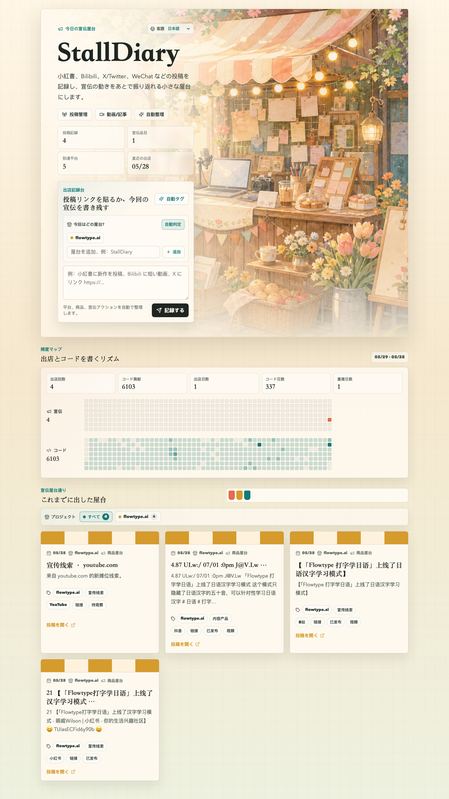

# StallDiary

[English](README.md) | [简体中文](README.zh-Hans.md) | [繁體中文](README.zh-Hant.md) | [日本語](README.ja.md) | [한국어](README.ko.md)

StallDiary は、個人開発者向けのオープンソース宣伝日記です。投稿リンク、SNS の投稿、短いメモを貼り付けると、製品、チャネル、状態、活動頻度を含む「出店」ログとして整理できます。



プレビュー画像はサンプルデータを使用しており、実際のデモ用データベースには接続していません。

## 機能

- 製品ごとに宣伝ログを記録し、Web 画面で屋台を選択または追加できます。
- 製品タイプ、投稿チャネル、状態、元リンク、屋台スタイルを自動でタグ付けします。
- GitHub の contribution graph のように、宣伝頻度とコード頻度を比較できます。
- AI / 自動化ツールから記録できる書き込み API を提供します。
- 簡体字中国語、繁体字中国語、英語、日本語、韓国語に対応しています。
- Cloudflare Worker、Vite React、PostgreSQL で構成されています。

## クイックスタート

```bash
npm install
cp .env.example .env.local
npm run db:migrate
npm run dev
```

`http://127.0.0.1:3000` を開いてください。

## 環境変数

| 名前 | 必須 | 説明 |
| --- | --- | --- |
| `DATABASE_URL` | はい | PostgreSQL 接続文字列。実値をコミットしないでください。 |
| `AGENT_WRITE_TOKEN` | 任意 | `/api/agent/stalls` と `/api/scale/stalls` の書き込み API を保護します。 |
| `GITHUB_LOGIN` | 任意 | コード頻度マップに使う GitHub ユーザー名。 |
| `GITHUB_TOKEN` | 任意 | GitHub contribution calendar を取得するためのトークン。 |

## ライセンス

MIT。詳しくは [LICENSE](LICENSE) を参照してください。

## フォロー

X で作者をフォローできます: [@benshandebiao](https://x.com/benshandebiao)。
