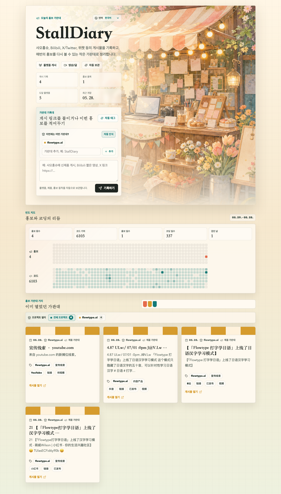

# StallDiary

[English](README.md) | [简体中文](README.zh-Hans.md) | [繁體中文](README.zh-Hant.md) | [日本語](README.ja.md) | [한국어](README.ko.md)

StallDiary는 독립 개발자를 위한 오픈소스 홍보 일지입니다. 출시 링크, 소셜 게시물, 짧은 메모를 붙여 넣으면 제품, 채널, 상태, 활동 빈도를 포함한 “가판대” 기록으로 정리할 수 있습니다.



미리보기 이미지는 샘플 데이터를 사용하며 실제 데모 데이터베이스에 연결하지 않습니다.

## 기능

- 제품별 홍보 로그를 기록하고 웹 화면에서 가판대를 선택하거나 추가할 수 있습니다.
- 제품 유형, 게시 채널, 상태, 원본 링크, 가판대 스타일을 자동으로 태그합니다.
- GitHub contribution graph처럼 홍보 빈도와 코드 빈도를 비교할 수 있습니다.
- AI / 자동화 도구에서 기록을 저장할 수 있는 쓰기 API를 제공합니다.
- 중국어 간체, 중국어 번체, 영어, 일본어, 한국어를 지원합니다.
- Cloudflare Worker, Vite React, PostgreSQL 기반으로 구성되어 있습니다.

## 빠른 시작

```bash
npm install
cp .env.example .env.local
npm run db:migrate
npm run dev
```

`http://127.0.0.1:3000` 를 여세요.

## 환경 변수

| 이름 | 필수 | 설명 |
| --- | --- | --- |
| `DATABASE_URL` | 예 | PostgreSQL 연결 문자열입니다. 실제 값을 커밋하지 마세요. |
| `AGENT_WRITE_TOKEN` | 선택 | `/api/agent/stalls` 와 `/api/scale/stalls` 쓰기 API를 보호합니다. |
| `GITHUB_LOGIN` | 선택 | 코드 빈도 맵에 사용할 GitHub 사용자 이름입니다. |
| `GITHUB_TOKEN` | 선택 | GitHub contribution calendar를 가져오기 위한 토큰입니다. |

## 라이선스

MIT. 자세한 내용은 [LICENSE](LICENSE)를 참고하세요.

## 팔로우

X에서 만든 사람을 팔로우하세요: [@benshandebiao](https://x.com/benshandebiao).
