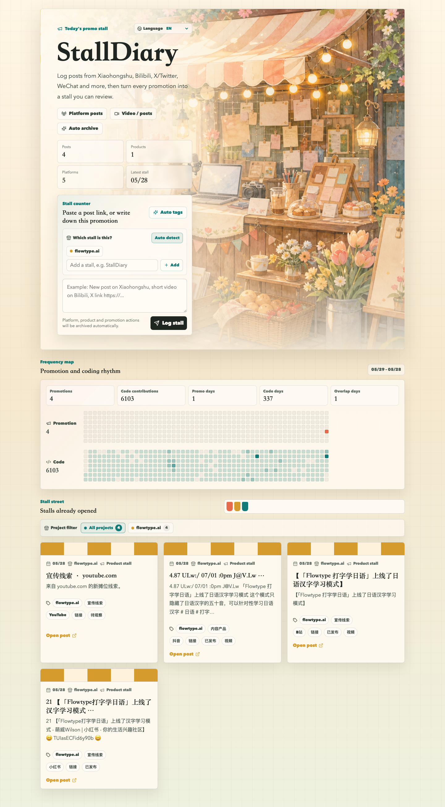

# StallDiary

[English](README.md) | [简体中文](README.zh-Hans.md) | [繁體中文](README.zh-Hant.md) | [日本語](README.ja.md) | [한국어](README.ko.md)

StallDiary is an open-source promotion diary for independent builders. Paste a launch link, social post, or short note, and StallDiary turns it into a browsable "stall" with product, channel, mood, and activity metadata.



The preview image uses sample data and does not point to a live demo database.

## Features

- Product-aware promotion logs with a web composer and product picker.
- Automatic tags for product type, channel, mood, source URL, and stall style.
- GitHub-style heatmaps comparing promotion frequency with code contribution frequency.
- AI / automation write endpoint for saving logs from assistants, Scale, scripts, or other tools.
- Multilingual interface: Simplified Chinese, Traditional Chinese, English, Japanese, and Korean.
- Cloudflare Worker API, Vite React frontend, and PostgreSQL storage.

## Tech Stack

- React 18 + Vite
- Cloudflare Workers + Workers Assets
- PostgreSQL via `pg`
- Optional GitHub GraphQL contribution calendar

## Requirements

- Node.js 20.19 or newer
- PostgreSQL 14 or newer
- A Cloudflare account for Worker deployment
- Optional GitHub token for the code contribution heatmap

## Quick Start

```bash
npm install
cp .env.example .env.local
npm run db:migrate
npm run dev
```

Open `http://127.0.0.1:3000`.

## Environment Variables

| Name | Required | Used by | Description |
| --- | --- | --- | --- |
| `DATABASE_URL` | Yes | Local scripts, Worker fallback | PostgreSQL connection string. Do not commit real values. |
| `AGENT_WRITE_TOKEN` | Optional | Worker | Bearer token for `/api/agent/stalls` and `/api/scale/stalls`. |
| `GITHUB_LOGIN` | Optional | Worker | GitHub username for the code heatmap. |
| `GITHUB_TOKEN` | Optional | Worker | GitHub token with access to contribution calendar data. |

Cloudflare secrets:

```bash
npx wrangler secret put DATABASE_URL
npx wrangler secret put AGENT_WRITE_TOKEN
npx wrangler secret put GITHUB_TOKEN
```

For public forks, edit `wrangler.toml` and replace the worker name, custom domain, and `GITHUB_LOGIN` with your own values.

## Database

Run the schema migration:

```bash
npm run db:migrate
```

The migration creates:

- `stall_products`
- `stall_entries`
- indexes for activity, product lookup, and product tags

## Development Scripts

```bash
npm run dev        # Start Vite dev server
npm run build      # Build frontend assets
npm run preview    # Build and run wrangler dev
npm run typecheck  # Run TypeScript checks
npm run db:migrate # Apply PostgreSQL schema
```

Add a log from the command line:

```bash
npm run entry:add -- "Posted a new product update on Xiaohongshu: https://example.com"
```

## AI / Automation Save Endpoint

```bash
curl -X POST https://your-stalldiary.example.com/api/agent/stalls \
  -H "Authorization: Bearer $AGENT_WRITE_TOKEN" \
  -H "Content-Type: application/json" \
  -d '{"productName":"StallDiary","rawInput":"Posted a new launch note: https://example.com"}'
```

The compatibility path `/api/scale/stalls` accepts the same payload.

Use `dryRun: true` to test parsing without writing to the database.

## Deployment

```bash
npm run build
npm run deploy
```

See [docs/deployment.md](docs/deployment.md) for Cloudflare, PostgreSQL, custom domain, and secret setup notes.

## Internationalization

The app detects browser language and stores manual selection in `localStorage`.

Supported URL overrides:

- `?lang=zh-Hans`
- `?lang=zh-Hant`
- `?lang=en`
- `?lang=ja`
- `?lang=ko`

Saved log content, product names, and generated tags are kept in their original language.

## Security

- Never commit `.env`, `.env.local`, `.dev.vars`, database URLs, API tokens, or bearer tokens.
- Rotate any credential that was ever pushed to a public branch.
- Use `AGENT_WRITE_TOKEN` for machine writes.
- Prefer separate databases for development and production.

See [SECURITY.md](SECURITY.md).

Before making a previously private repository public, follow [docs/open-source-release.md](docs/open-source-release.md).

## Contributing

Issues and pull requests are welcome. See [CONTRIBUTING.md](CONTRIBUTING.md).

## License

MIT. See [LICENSE](LICENSE).

## Follow

Follow the maker on X: [@benshandebiao](https://x.com/benshandebiao).
