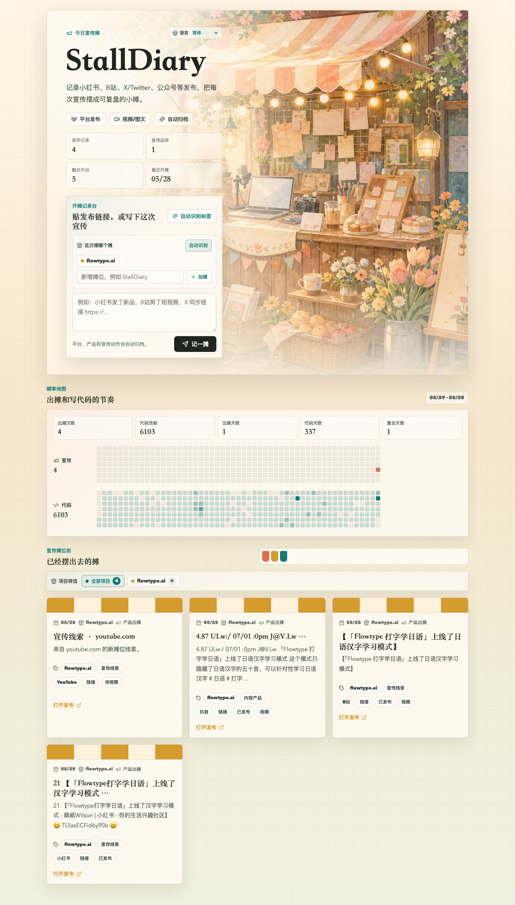

# StallDiary

[English](README.md) | [简体中文](README.zh-Hans.md) | [繁體中文](README.zh-Hant.md) | [日本語](README.ja.md) | [한국어](README.ko.md)

StallDiary 是一个面向独立开发者的开源宣传日记。你可以粘贴发布链接、社交媒体帖子或简短记录，它会把每次宣传整理成可浏览的“出摊”记录，并自动归纳产品、渠道、状态和活动频率。



截图使用示例数据，不连接真实演示数据库。

## 功能

- 支持按产品记录宣传日志，并在网页端选择或新增摊位。
- 自动识别产品类型、发布渠道、心情状态、来源链接和摊位风格。
- 提供类似 GitHub 贡献图的宣传频率与代码频率对比。
- 提供 AI / 自动化写入接口，可从助手、脚本或其他工具同步记录。
- 支持简体中文、繁体中文、英语、日语和韩语。
- 基于 Cloudflare Worker、Vite React 和 PostgreSQL。

## 快速开始

```bash
npm install
cp .env.example .env.local
npm run db:migrate
npm run dev
```

打开 `http://127.0.0.1:3000`。

## 环境变量

| 名称 | 必填 | 说明 |
| --- | --- | --- |
| `DATABASE_URL` | 是 | PostgreSQL 连接字符串。不要提交真实值。 |
| `AGENT_WRITE_TOKEN` | 可选 | 保护 `/api/agent/stalls` 和 `/api/scale/stalls` 写入接口。 |
| `GITHUB_LOGIN` | 可选 | 用于代码频率图的 GitHub 用户名。 |
| `GITHUB_TOKEN` | 可选 | 用于读取 GitHub contribution calendar。 |

## 许可证

MIT。详见 [LICENSE](LICENSE)。

## 关注

欢迎关注我的 X：[@benshandebiao](https://x.com/benshandebiao)。
