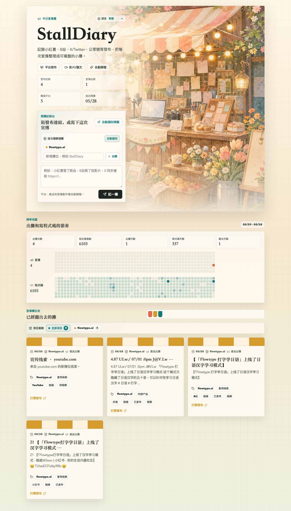

# StallDiary

[English](README.md) | [简体中文](README.zh-Hans.md) | [繁體中文](README.zh-Hant.md) | [日本語](README.ja.md) | [한국어](README.ko.md)

StallDiary 是一個面向獨立開發者的開源宣傳日記。你可以貼上發布連結、社群貼文或簡短記錄，它會把每次宣傳整理成可瀏覽的「出攤」記錄，並自動歸納產品、渠道、狀態和活動頻率。



截圖使用示例資料，不連接真實示範資料庫。

## 功能

- 支援按產品記錄宣傳日誌，並在網頁端選擇或新增攤位。
- 自動識別產品類型、發布渠道、心情狀態、來源連結和攤位風格。
- 提供類似 GitHub 貢獻圖的宣傳頻率與程式碼頻率對比。
- 提供 AI / 自動化寫入接口，可從助手、腳本或其他工具同步記錄。
- 支援簡體中文、繁體中文、英語、日語和韓語。
- 基於 Cloudflare Worker、Vite React 和 PostgreSQL。

## 快速開始

```bash
npm install
cp .env.example .env.local
npm run db:migrate
npm run dev
```

打開 `http://127.0.0.1:3000`。

## 環境變數

| 名稱 | 必填 | 說明 |
| --- | --- | --- |
| `DATABASE_URL` | 是 | PostgreSQL 連接字串。不要提交真實值。 |
| `AGENT_WRITE_TOKEN` | 可選 | 保護 `/api/agent/stalls` 和 `/api/scale/stalls` 寫入接口。 |
| `GITHUB_LOGIN` | 可選 | 用於程式碼頻率圖的 GitHub 使用者名稱。 |
| `GITHUB_TOKEN` | 可選 | 用於讀取 GitHub contribution calendar。 |

## 授權

MIT。詳見 [LICENSE](LICENSE)。

## 關注

歡迎關注我的 X：[@benshandebiao](https://x.com/benshandebiao)。
